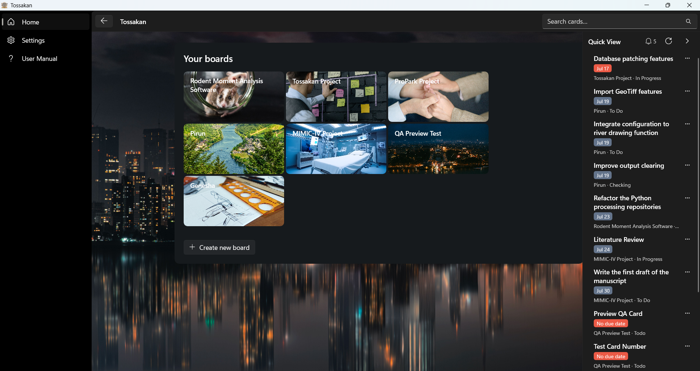
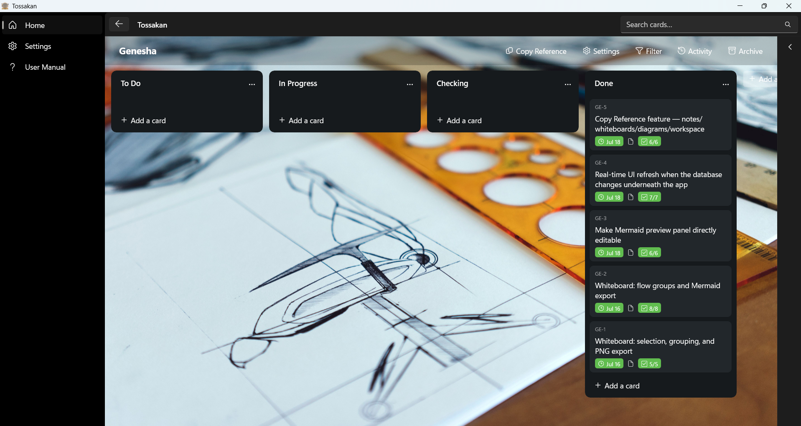
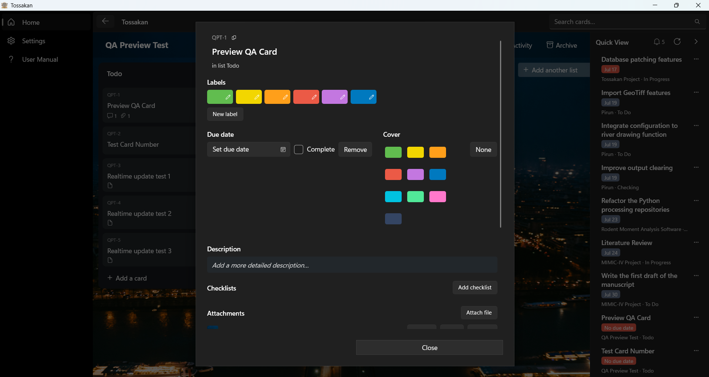

# Tossakan

A free, open source, Trello style kanban board for Windows. Built with WinUI 3 and .NET 8.
No account, no cloud, no subscription. Your boards live in a local SQLite database on your own
machine, full stop.


## Download

Grab a ready to run build from the [Releases page](https://github.com/panason-m/tossakan/releases)
— download the zip, extract it anywhere, and run `Tossakan.exe`. No installer, no .NET SDK
required; the build is self contained.

Prefer to build it yourself? See [Getting started](#getting-started) below.

## Screenshots

| | |
|---|---|
|  |  |
| Your boards, at a glance | A board in action: lists, cards, checklist progress, and Quick View |



Full card detail: labels, due date, cover color, checklists, and attachments.

## Why this exists

Most kanban tools push you toward a hosted account, a subscription, and your task data living on
someone else's server. Tossakan is the opposite bet: a native Windows app that runs entirely on
your machine, stores everything in a plain SQLite file you can back up or inspect yourself, and
never talks to a network. If that sounds useful to you, it is free to use, free to fork, and
contributions are welcome.

## What it does

- **Boards**: create as many as you like, each with its own background (a solid color or a
  photo) and its own set of labels
- **Lists**: columns within a board (To Do, In Progress, Test, Done, or whatever you name them),
  freely reordered by drag, archived or deleted
- **Cards**: the unit of work, with a description, custom labels, a due date (with overdue/today
  highlighting), checklists with progress tracking, comments, file attachments, a cover color, and
  drag and drop within and across lists
- **Search**: a title bar search box finds cards by title across every board
- **Filter**: per board filter by keyword, label, and due date status
- **Activity log**: every change on a board is recorded and browsable per board
- **Archive**: cards, lists, and boards are soft deleted to an archive first, and can be restored
- **Theming**: follows Windows light/dark mode automatically

## Compatibility

Tossakan targets Windows only, via WinUI 3 / the Windows App SDK. There is no macOS or Linux
build, and none is planned since the UI framework itself is Windows specific.

- Windows 10, build 19041 or later, or Windows 11
- x64 only
- Standalone published builds are self contained: they bundle the .NET runtime and the Windows
  App SDK, so they run on a machine with nothing else installed

## Tech stack

| Layer | Choice |
|---|---|
| UI framework | WinUI 3 (Windows App SDK 1.8.x), unpackaged desktop app |
| Language/runtime | C#, .NET 8 (`net8.0-windows10.0.19041.0`) |
| MVVM helpers | CommunityToolkit.Mvvm |
| Data access | EF Core 8 + SQLite (`Microsoft.EntityFrameworkCore.Sqlite`) |
| Persistence | `EnsureCreated()` on first run, no EF migrations; hand rolled schema patches for later additive changes |

Project layout:

```
src/Tossakan/
  Models/Entities.cs       All EF entities: Board, BoardList, Card, Label, Checklist, Comment, Attachment, ActivityEntry
  Data/                    AppDbContext, DatabaseInitializer (schema creation + welcome board seed)
  Services/                BoardService (all CRUD/reorder/archive/search), AttachmentService, BackgroundImageService, AppPaths
  ViewModels/              Card/List snapshot view models used by the UI
  Views/                   HomePage, BoardPage, CardDetailDialog, BoardEditDialog
  Assets/                  Bundled app icon and default background photo
```

Everything is built with the `dotnet` CLI. No Visual Studio install is required.

## Getting started

Prerequisites: [.NET 8 SDK](https://dotnet.microsoft.com/download/dotnet/8.0) (x64), Windows 10
19041+ or Windows 11.

```
git clone https://github.com/panason-m/tossakan.git
cd tossakan
dotnet run --project "src\Tossakan"
```

That restores packages, builds a Debug binary, and launches the app. On first launch it seeds a
"Welcome Board" so there is something to look at immediately.

## Building and publishing a release build

A standalone build bundles the .NET runtime and the Windows App SDK so it runs on a machine with
nothing else installed. No installer, just a folder you run or zip up.

One step publish (recommended):

```
powershell -ExecutionPolicy Bypass -File .\publish.ps1
```

This runs `dotnet publish` in Release mode for `win-x64`, self contained, into `.\publish\`, and
creates a desktop shortcut pointing at `publish\Tossakan.exe`.

Manual publish, equivalent without the shortcut step:

```
dotnet publish "src\Tossakan\Tossakan.csproj" -c Release -r win-x64 --self-contained true -o publish
```

To distribute the build, copy the entire `publish\` folder, not just the exe, since it depends on
sibling `.dll`/`.pri` files and language resource folders next to it. There is no installer; it
runs directly from that folder.

Re-publishing after changes is just re-running the same command; it overwrites `publish\` in
place.

## Where your data lives

Everything is stored locally, per Windows user, never sent anywhere:

- Database: `%LOCALAPPDATA%\Tossakan\workmanagement.db` (SQLite)
- Attachments: `%LOCALAPPDATA%\Tossakan\attachments\`
- Custom background photos: `%LOCALAPPDATA%\Tossakan\backgrounds\`
- Error log: `%LOCALAPPDATA%\Tossakan\app.log` (unhandled exceptions land here instead of
  crashing the app; check it first if the UI seems to silently do nothing)

Back up the whole `%LOCALAPPDATA%\Tossakan` folder to back up every board.

## Letting your local AI agent recognize Tossakan

Tossakan has no API on purpose. All state lives in one SQLite file, which means any local
agentic AI tool you already run (Claude Code, Cursor, or anything else with file/shell access)
can read and write your boards directly, with no server, no auth, and no SDK to install.

The app is usually running while your agent works, so keep connections short lived: open, do
one read or one write inside a transaction, close. Don't hold a connection open across multiple
tool calls.

Schema, in brief:

- `Boards` (Id, Name, NextCardNumber)
- `Lists` (BoardId, ...)
- `Cards` (ListId, Title, Description, ReferenceNumber -- the number in a card code like
  "PROJ-2": board prefix + ReferenceNumber)
- `Checklists` / `ChecklistItems`
- `Comments`
- `Labels` / `CardLabels`
- `Activities` (audit log of every mutation)

To make your own agent aware of this, drop something like the following into whatever file your
tool reads for standing instructions (`CLAUDE.md`, `AGENTS.md`, `.cursorrules`, etc.):

```
Tossakan is a local kanban app. Its database is at
%LOCALAPPDATA%\Tossakan\workmanagement.db (SQLite). Read or write it directly with any
SQLite client (the `sqlite3` CLI, DB Browser for SQLite, or a couple lines of Python's
built in sqlite3 module all work). Use short lived connections and transactions since
the app itself may be running at the same time. Tables: Boards, Lists, Cards,
Checklists, ChecklistItems, Comments, Labels, CardLabels, Activities.
```

This repository also ships its own `CLAUDE.md` at the root with the full internal architecture
and known pitfalls, so a coding agent working on Tossakan's source picks up real project context
automatically instead of guessing.

## Contributing

Issues and pull requests are welcome. The codebase is small enough to read end to end in an
afternoon: services hold all the business logic, view models are thin snapshots, and views are
plain WinUI XAML with code behind.

## License

MIT, see [LICENSE](LICENSE). Use it, fork it, ship your own version, no permission needed.
